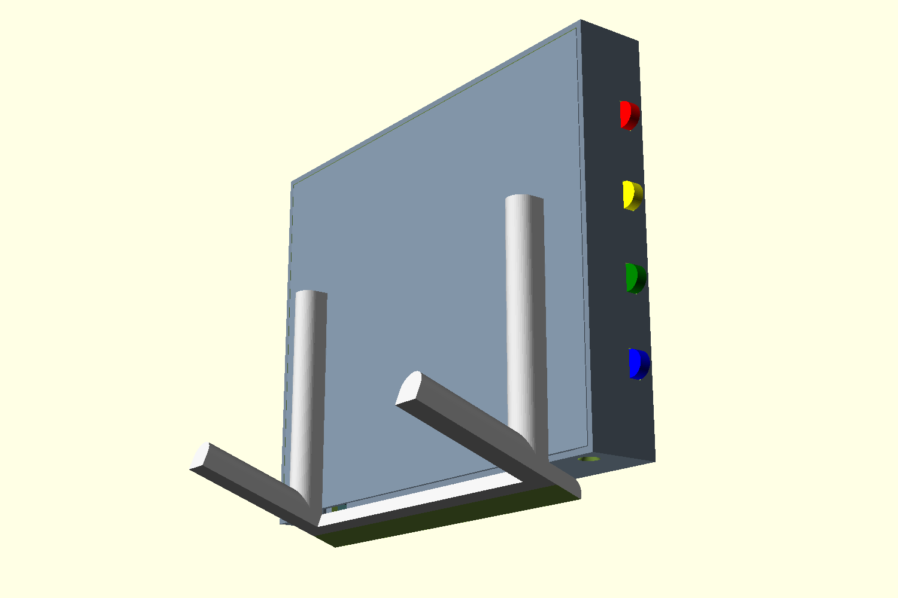

# Inky Impression Case

## Introduction

This is a wall-mounting case for the [Pimoroni Inky Impression](https://shop.pimoroni.com/products/inky-impression) 7-colour e-ink display. I wanted to make a simple protective case for the display and a Raspberry Pi Zero W which had the following features:

* A clean front with no visible fixings and a symmetrical border around the image area
* No pressure applied to the fragile glass screen of the Inky Impression
* Access to the 4 buttons on the Inky Impression board
* Access to the breakout connector on the Inky Impression board
* Simple wall-mounting

The Inky Impression only has mounting points on the back surface, which makes it hard to produce a standard, 3d-printable case that doesn't put any pressure on the fragile glass front. Pressing it into a frame or sliding it into slots might put too much strain on some areas. I solved this by adding a backplane within the case, which screws to the Inky Impression's mount points and holds it slightly away from the front of the case.

Side-mounted buttons are also held in position by the backplane and help activate the switches on the Inky Impression board when it is in the case. The rear panel has keyholes for wall-mounting on screws, and is held onto the front of the case by 4 bolts (with optional threaded inserts). The case has a cutout at the bottom for access to the breakout connector and as a cable-exit for the Raspberry Pi's power cable.

## Printing

Print the following parts:

* 1 x inky-impression-case-frame.stl
* 1 x inky-impression-case-backplane.stl
* 4 x inky-impression-case-button.stl

And, depending on whether or not you are using threaded inserts, either:

* 1 x inky-impression-case-rearpanel.stl (with inserts)

or:

* 1 x inky-impression-case-rearpanel-no-inserts.stl (without inserts)

The design is optimised for a 0.4mm nozzle and 0.2mm layer height with 20% infill. Using a concentric pattern on the bottom layer gives a nice finish to the frame.

You will also need:

* 4 x M2.5 bolts, 6mm long (you can use the ones supplied with the Inky Impression)
* 4 x M2.5 countersunk bolts, 6mm long
* [OPTIONAL: 4 x M2.5 threaded inserts - brass heat-set type, external diameter 3.5mm, length 4-6mm]

## Construction

* Test that the backplane fits right down into the frame to rest on the ledges around the top and sides. It should be a really snug fit - sandpaper the edges of the backplane a bit if it won't go in on the first try!
* Mount the backplane to the Inky Impression using the M2.5 bolts that are supplied with the display.
* Lay the frame face down on a worksurface and slide the four buttons into the slots in the side, with the rectangular lugs on each button facing towards you.
* Gently slide the Inky Impression on its backplane into the frame, with the screen facing down and the slots for the buttons on the correct side.
* Carefully press the Raspberry Pi Zero onto the header on the Inky Impression so that it is held firmly in place. Attach a Micro USB cable to the connector nearest the corner of the Pi and lead the cable through the slot in the bottom of the frame.
* [Heat-set the inserts](https://markforged.com/resources/blog/heat-set-inserts) (if using) into the mounts on the rear panel and then place the rear panel into the frame. The pads on the rear panel mounts should hold the backplane in place within the case.
* Use the M2.5 countersunk bolts to secure the rear panel to the case.
* To wall-mount, place two screws on the wall, 100mm apart and horizontally in line with where you want the centre of the screen, then slot the keyholes in the rear panel onto the screws.

## Customisation

I have included the OpenScad file for the design. It has some basic parameters that allow you to change the size and type of the fixing bolts for the case. Read the comments in the file to see how to use it.
